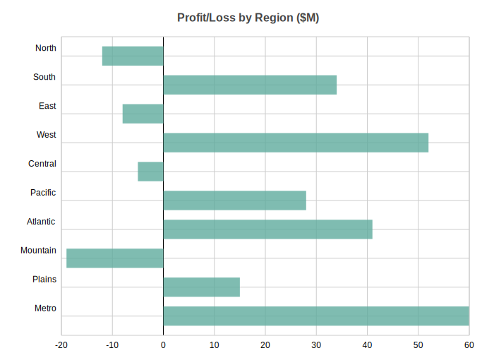
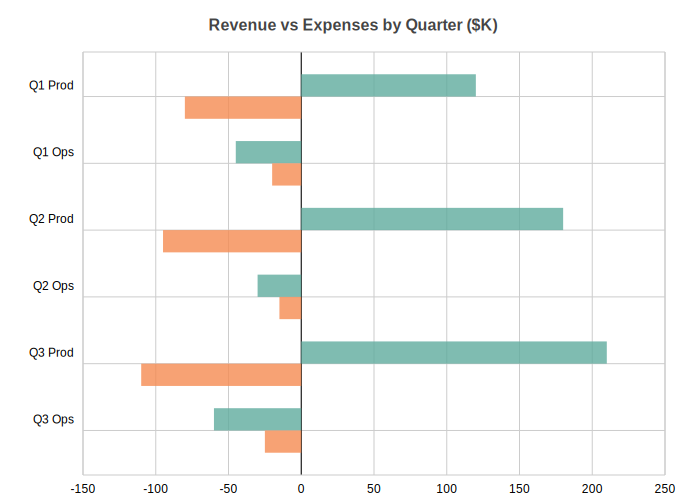
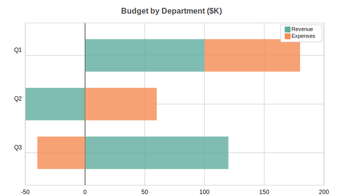

Bar Charts
==========

Horizontal bar chart with support for single/multi-series, stacked and side-by-side layouts. Handles negative values with proper zero baseline.

Basic Usage
-----------

Single series bars::

   from charted.charts import BarChart

   chart = BarChart(
       data=[120, 180, 210, 150],
       labels=["Q1", "Q2", "Q3", "Q4"],
       title="Sales by Quarter"
   )
   chart.save("bars.svg")

With Negative Values
--------------------

Bar charts handle negative values, extending left from the zero baseline::

   chart = BarChart(
       title="Profit/Loss by Region ($M)",
       data=[-12, 34, -8, 52, -5, 28, 41, -19, 15, 60],
       labels=["North", "South", "East", "West", "Central", "Pacific", "Atlantic", "Mountain", "Plains", "Metro"],
       width=700,
       height=500,
   )

Multi-Series Side-by-Side
-------------------------

Multiple bars per category for comparison::

   chart = BarChart(
       title="Revenue vs Expenses by Quarter ($K)",
       data=[
           [120, -45, 180, -30, 210, -60],   # Revenue
           [-80, -20, -95, -15, -110, -25],  # Expenses
       ],
       labels=["Q1 Prod", "Q1 Ops", "Q2 Prod", "Q2 Ops", "Q3 Prod", "Q3 Ops"],
       series_names=["Revenue", "Expenses"],
       width=700,
       height=500,
   )

Stacked Bars
------------

Stack bars horizontally to show cumulative values::

   chart = BarChart(
       title="Budget by Department ($K)",
       data=[
           [100, -50, 120],    # Revenue
           [80, 60, -40],      # Expenses
       ],
       labels=["Q1", "Q2", "Q3"],
       series_names=["Revenue", "Expenses"],
       x_stacked=True,
       width=700,
       height=400,
   )

Configuration Options
---------------------

Bar spacing::

   # Adjust gap between bars (0-1, default 0.5)
   chart = BarChart(
       data=[1, 2, 3],
       labels=["a", "b", "c"],
       bar_gap=0.3  # Tighter bars
   )

Custom theme::

   chart = BarChart(
       data=[120, 180, 210],
       labels=["Q1", "Q2", "Q3"],
       theme="dark",  # or "light", "high-contrast"
   )

   # Custom theme with specific colors
   chart = BarChart(
       data=[120, 180, 210],
       labels=["Q1", "Q2", "Q3"],
       theme={
           "colors": {
               "palette": ["#FF6B6B", "#4ECDC4", "#45B7D1"]
           },
           "bar": {
               "gap": 0.2
           }
       }
   )

API Reference
-------------

.. autoclass:: charted.charts.bar.BarChart
   :members:
   :undoc-members:
   :show-inheritance:

   **Parameters:**

   - ``data`` — Single list for one series, or list of lists for multi-series
   - ``labels`` — Y-axis category labels
   - ``series_names`` — Names for each data series (shown in legend)
   - ``x_stacked`` — If True, stack bars horizontally
   - ``bar_gap`` — Gap between bars as ratio (0-1, default 0.5)
   - ``width`` — Chart width in pixels (default 800)
   - ``height`` — Chart height in pixels (default 600)
   - ``theme`` — Theme name string or theme dictionary
   - ``title`` — Chart title text
   - ``subtitle`` — Optional subtitle text

   **Example:**

   .. code-block:: python

      from charted import BarChart

      chart = BarChart(
          data=[-12, 34, -8, 52],
          labels=["North", "South", "East", "West"],
          title="Regional Performance",
          theme="dark"
      )
      chart.save("bar.svg")
      print(chart.to_markdown())  # 
