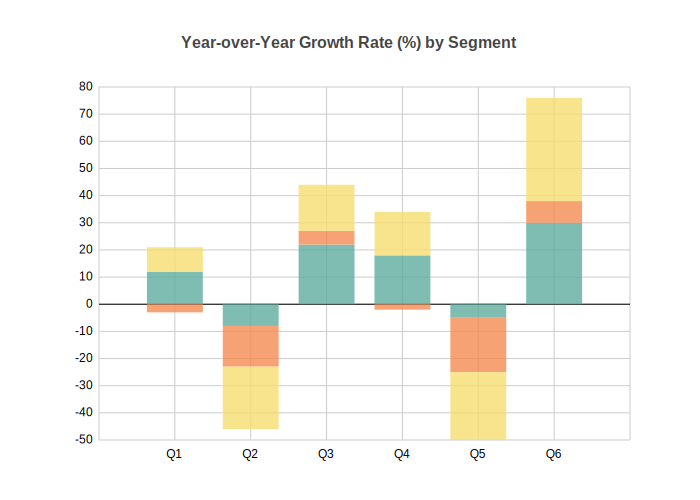
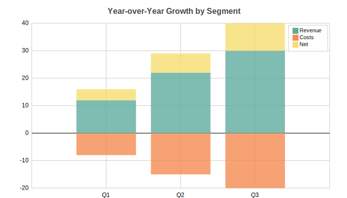
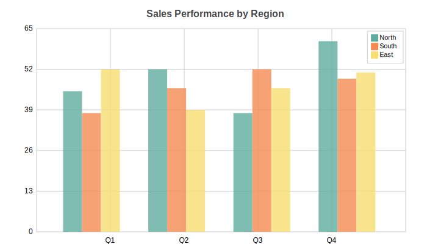

Column Charts
=============

Vertical column chart with support for multi-series, stacked layouts, and side-by-side grouping. Handles negative values with proper zero baseline.

Basic Usage
-----------

Single series columns::

   from charted.charts import ColumnChart

   chart = ColumnChart(
       data=[12, 22, 30, 18, 25],
       labels=["Q1", "Q2", "Q3", "Q4", "Q5"],
       title="Monthly Sales"
   )
   chart.save("columns.svg")

With Negative Values
--------------------

Column charts automatically handle negative values, extending below the zero baseline::

   chart = ColumnChart(
       title="Year-over-Year Growth Rate (%) by Segment",
       data=[12, -8, 22, 18, -5, 30],
       labels=["Q1", "Q2", "Q3", "Q4", "Q5", "Q6"],
       width=700,
       height=500,
   )

Multi-Series Stacked
--------------------

Stacked columns show cumulative values with each series stacked on top::

   chart = ColumnChart(
       title="Revenue vs Costs vs Net (%)",
       data=[
           [12, -8, 22, 18, -5, 30],    # Revenue
           [-3, -15, 5, -2, -20, 8],    # Costs
           [9, -23, 17, 16, -25, 38],   # Net
       ],
       labels=["Q1", "Q2", "Q3", "Q4", "Q5", "Q6"],
       series_names=["Revenue", "Costs", "Net"],
       y_stacked=True,  # Default for multi-series
       width=700,
       height=500,
   )

Multi-Series Side-by-Side
-------------------------

Grouped columns display series side-by-side for comparison::

   chart = ColumnChart(
       title="Revenue vs Expenses by Quarter",
       data=[
           [120, 180, 210],      # Revenue
           [80, 95, 110],        # Expenses
       ],
       labels=["Q1", "Q2", "Q3"],
       series_names=["Revenue", "Expenses"],
       y_stacked=False,  # Side-by-side
       width=700,
       height=500,
   )

Configuration Options
---------------------

Column spacing::

   # Adjust gap between columns (0-1, default 0.5)
   chart = ColumnChart(
       data=[1, 2, 3],
       labels=["a", "b", "c"],
       column_gap=0.3  # Tighter columns
   )

Custom theme::

   chart = ColumnChart(
       data=[12, 22, 30],
       labels=["Q1", "Q2", "Q3"],
       theme="dark",  # or "light", "high-contrast"
   )

   # Or custom theme dict
   chart = ColumnChart(
       data=[12, 22, 30],
       labels=["Q1", "Q2", "Q3"],
       theme={
           "colors": {
               "palette": ["#FF6B6B", "#4ECDC4", "#45B7D1"]
           },
           "column": {
               "gap": 0.2
           }
       }
   )

API Reference
-------------

.. autoclass:: charted.charts.column.ColumnChart
   :members:
   :undoc-members:
   :show-inheritance:

   **Parameters:**

   - ``data`` — Single list for one series, or list of lists for multi-series
   - ``labels`` — X-axis category labels
   - ``series_names`` — Names for each data series (shown in legend)
   - ``y_stacked`` — If True, stack columns vertically (default for multi-series)
   - ``column_gap`` — Gap between columns as ratio (0-1, default 0.5)
   - ``width`` — Chart width in pixels (default 800)
   - ``height`` — Chart height in pixels (default 600)
   - ``theme`` — Theme name string or theme dictionary
   - ``title`` — Chart title text
   - ``subtitle`` — Optional subtitle text

   **Example:**

   .. code-block:: python

      from charted import ColumnChart

      chart = ColumnChart(
          data=[[120, 180, 210], [80, 95, 110]],
          labels=["Q1", "Q2", "Q3"],
          series_names=["Revenue", "Expenses"],
          title="Quarterly Performance",
          y_stacked=True
      )
      chart.save("column.svg")
      print(chart.to_markdown())  # 
