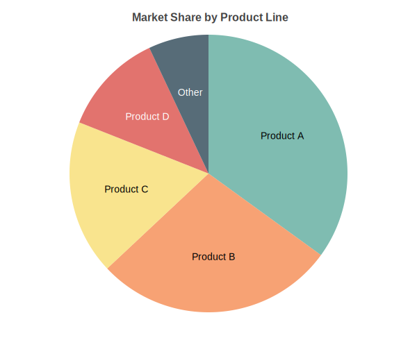
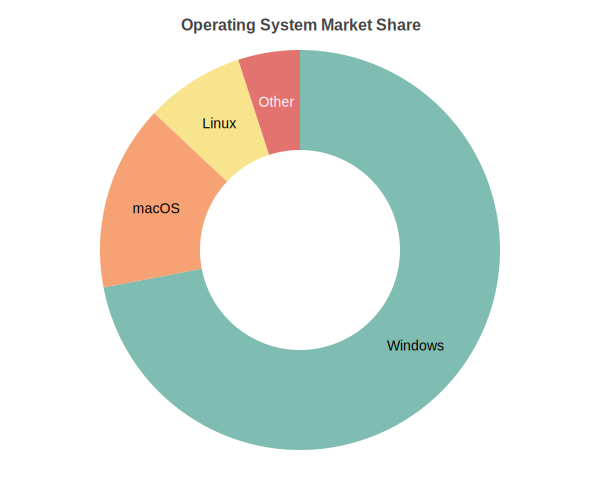

Pie Charts
==========

Circular chart displaying categorical data as proportional slices. Supports doughnut mode, per-slice styling, and exploded slices.

Basic Usage
-----------

Simple pie chart::

   from charted.charts import PieChart

   chart = PieChart(
       data=[45, 30, 15, 10],
       labels=["Electronics", "Clothing", "Food", "Other"],
       series_names=["Sales"],
       title="Revenue by Category"
   )
   chart.save("pie.svg")

Doughnut Mode
-------------

Create a doughnut chart by setting inner_radius::

   chart = PieChart(
       title="Sales Distribution",
       data=[45, 30, 15, 10],
       labels=["Electronics", "Clothing", "Food", "Other"],
       series_names=["Sales"],
       width=500,
       height=400,
       doughnut=True,
       inner_radius=0.5  # 50% of outer radius
   )

Customizing Doughnut::

   chart = PieChart(
       data=[300, 150, 100],
       labels=["Product A", "Product B", "Product C"],
       doughnut=True,
       inner_radius=0.4,  # Smaller hole
       theme={
           "pie": {
               "outer_radius": 0.85,
               "border_width": 3.0,
               "border_color": "#FFFFFF"
           }
       }
   )

Exploded Slices
---------------

Highlight specific slices by exploding them outward::

   # Explode all slices uniformly
   chart = PieChart(
       data=[45, 30, 15, 10],
       labels=["A", "B", "C", "D"],
       theme={
           "pie": {
               "explode": 0.1  # Explode all by 10%
           }
       }
   )

   # Explode specific slices
   chart = PieChart(
       data=[45, 30, 15, 10],
       labels=["A", "B", "C", "D"],
       slice_styles={
           0: {"explode": 0.15},  # Slice A exploded
           1: {"explode": 0.0},   # Slice B normal
           2: {"explode": 0.1},   # Slice C slightly exploded
           3: {"explode": 0.0},   # Slice D normal
       }
   )

Per-Slice Styling
-----------------

Customize individual slices with colors, labels, and explosion::

   chart = PieChart(
       data=[300, 150, 100, 50],
       labels=["Product A", "Product B", "Product C", "Product D"],
       series_names=["Sales"],
       title="Market Share",
       slice_styles={
           0: {
               "color": "#FF6B6B",
               "explode": 0.1,
               "label_position": "outside"
           },
           1: {
               "color": "#4ECDC4",
               "label_position": "inside"
           },
           2: {
               "color": "#45B7D1",
               "label_position": "auto"
           },
           3: {
               "color": "#FFA07A",
               "label_position": "outside"
           }
       }
   )

Custom Colors
-------------

Override the default color palette::

   chart = PieChart(
       data=[300, 150, 100],
       labels=["A", "B", "C"],
       theme={
           "colors": {
               "palette": ["#2ECC71", "#3498DB", "#E74C3C"]
           }
       }
   )

Or use a built-in theme::

   chart = PieChart(
       data=[300, 150, 100],
       labels=["A", "B", "C"],
       theme="pastel"  # Soft pastel colors
   )

   chart = PieChart(
       data=[300, 150, 100],
       labels=["A", "B", "C"],
       theme="vibrant"  # Bold saturated colors
   )

Rotation and Angle
------------------

Control the starting angle of the pie::

   # Start from top (default)
   chart = PieChart(
       data=[45, 30, 15, 10],
       labels=["A", "B", "C", "D"]
   )

   # Start from right (90 degrees)
   chart = PieChart(
       data=[45, 30, 15, 10],
       labels=["A", "B", "C", "D"],
       theme={
           "pie": {
               # Note: start_angle is handled in chart code
           }
       }
   )

Label Positioning
-----------------

Control where labels appear::

   chart = PieChart(
       data=[300, 150, 100],
       labels=["Large", "Medium", "Small"],
       theme={
           "pie": {
               "label_position": "outside"  # Labels outside pie
           }
       }
   )

   chart = PieChart(
       data=[300, 150, 100],
       labels=["Large", "Medium", "Small"],
       theme={
           "pie": {
               "label_position": "inside"  # Labels inside slices
           }
       }
   )

   # Auto-position based on slice size
   chart = PieChart(
       data=[300, 150, 100],
       labels=["Large", "Medium", "Small"],
       theme={
           "pie": {
               "label_position": "auto"  # Default: smart positioning
           }
       }
   )

Configuration Options
---------------------

Complete pie customization::

   chart = PieChart(
       data=[300, 150, 100, 50],
       labels=["Product A", "Product B", "Product C", "Product D"],
       series_names=["Sales"],
       title="Revenue Distribution",
       width=600,
       height=500,
       doughnut=False,
       theme={
           "pie": {
               "inner_radius": 0,           # 0 for pie, 0.3-0.7 for doughnut
               "outer_radius": 0.8,         # Size relative to chart
               "label_position": "auto",    # "inside", "outside", "auto"
               "label_line_color": "#CCCCCC",
               "label_line_width": 1.0,
               "explode": 0,                # Default explode amount
               "border_color": "#FFFFFF",
               "border_width": 2.0
           },
           "colors": {
               "palette": ["#FF6B6B", "#4ECDC4", "#45B7D1", "#FFA07A"]
           }
       }
   )

API Reference
-------------

.. autoclass:: charted.charts.pie.PieChart
   :members:
   :undoc-members:
   :show-inheritance:

   **Parameters:**

   - ``data`` — Single list of values (one slice per value)
   - ``labels`` — Slice labels
   - ``series_names`` — Legend name for the data series
   - ``doughnut`` — If True, render as doughnut chart (default: False)
   - ``inner_radius`` — Inner radius ratio for doughnut mode (0.3-0.7, default: 0)
   - ``slice_styles`` — Dictionary mapping slice index to style overrides
   - ``width`` — Chart width in pixels (default 800)
   - ``height`` — Chart height in pixels (default 600)
   - ``theme`` — Theme name string or theme dictionary
   - ``title`` — Chart title text
   - ``subtitle`` — Optional subtitle text

   **Slice Style Options:**

   - ``color`` — Override slice color
   - ``explode`` — Explode distance (0-1 ratio)
   - ``label_position`` — "inside", "outside", or "auto"

   **Example:**

   .. code-block:: python

      from charted import PieChart

      chart = PieChart(
          data=[300, 150, 100, 50],
          labels=["Product A", "Product B", "Product C", "Product D"],
          series_names=["Sales"],
          title="Market Share",
          doughnut=True,
          inner_radius=0.5,
          slice_styles={
              0: {"color": "#FF6B6B", "explode": 0.1},
              1: {"color": "#4ECDC4"},
              2: {"color": "#45B7D1"},
              3: {"color": "#FFA07A"}
          }
      )
      chart.save("pie.svg")
      print(chart.to_markdown())  # 
