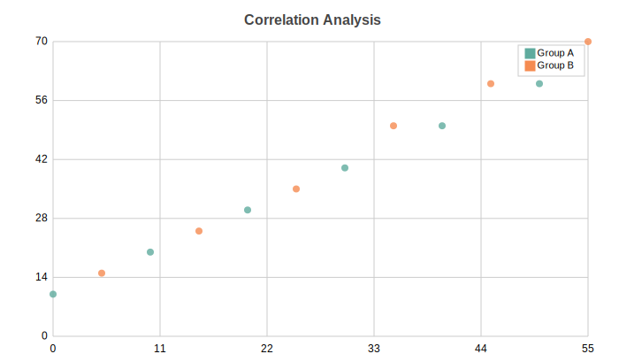

Scatter Charts
==============

Scatter plot with support for multi-series and custom marker shapes. Perfect for showing relationships between two variables.

Basic Usage
-----------

Single series scatter::

   from charted.charts import ScatterChart

   chart = ScatterChart(
       data=[[1, 2], [2, 3], [3, 5], [4, 4], [5, 7]],
       labels=["Data Points"],
       title="Correlation Example"
   )
   chart.save("scatter.svg")

Multi-Series
------------

Multiple scatter series for comparison::

   chart = ScatterChart(
       data=[
           [[1, 2], [2, 3], [3, 5], [4, 4]],      # Series A
           [[1, 1], [2, 2], [3, 4], [4, 6]],      # Series B
       ],
       labels=["Series A", "Series B"],
       title="Comparing Distributions",
       width=700,
       height=500,
   )

Custom X/Y Data
---------------

Alternative format with explicit x_data and y_data::

   chart = ScatterChart(
       x_data=[1, 2, 3, 4, 5],
       y_data=[2, 4, 5, 4, 6],
       labels=["Product Sales"],
       title="Price vs Sales"
   )

Marker Customization
--------------------

Change marker shape and size::

   # Circle markers (default)
   chart = ScatterChart(
       data=[[1, 2], [2, 3], [3, 5]],
       theme={
           "scatter": {
               "marker": "circle",
               "marker_size": 6.0
           }
       }
   )

   # Square markers
   chart = ScatterChart(
       data=[[1, 2], [2, 3], [3, 5]],
       theme={
           "scatter": {
               "marker": "square",
               "marker_size": 8.0
           }
       }
   )

   # Diamond markers
   chart = ScatterChart(
       data=[[1, 2], [2, 3], [3, 5]],
       theme={
           "scatter": {
               "marker": "diamond",
               "marker_size": 7.0
           }
       }
   )

Custom Marker Styling::

   chart = ScatterChart(
       data=[[1, 2], [2, 3], [3, 5]],
       theme={
           "scatter": {
               "marker": "circle",
               "marker_size": 8.0,
               "marker_border_width": 2.0,
               "marker_border_color": "#333333"
           }
       }
   )

With Trend Lines
----------------

Combine scatter with line chart for trend visualization::

   import math

   # Scatter data
   x = list(range(20))
   y = [math.sin(i * 0.5) * 30 + (i % 7 - 3) * 5 for i in range(20)]

   chart = ScatterChart(
       data=[[list(zip(x, y))]],
       labels=["Noisy Data"],
       title="Signal with Trend",
       theme={
           "scatter": {
               "marker": "circle",
               "marker_size": 4.0
           }
       }
   )

Configuration Options
---------------------

Custom colors per series::

   chart = ScatterChart(
       data=[[[1, 2], [2, 3]], [[1, 1], [2, 2]]],
       labels=["Series A", "Series B"],
       theme={
           "colors": {
               "palette": ["#2ECC71", "#3498DB"]
           },
           "scatter": {
               "marker_size": 6.0
           }
       }
   )

API Reference
-------------

.. autoclass:: charted.charts.scatter.ScatterChart
   :members:
   :undoc-members:
   :show-inheritance:

   **Parameters:**

   - ``data`` — List of [x, y] pairs, or list of lists for multi-series
   - ``x_data`` — Alternative: explicit x values (optional)
   - ``y_data`` — Alternative: explicit y values (optional)
   - ``labels`` — Series names (shown in legend)
   - ``width`` — Chart width in pixels (default 800)
   - ``height`` — Chart height in pixels (default 600)
   - ``theme`` — Theme name string or theme dictionary
   - ``title`` — Chart title text
   - ``subtitle`` — Optional subtitle text

   **Example:**

   .. code-block:: python

      from charted import ScatterChart

      chart = ScatterChart(
          data=[[1, 2], [2, 4], [3, 5], [4, 4], [5, 7]],
          labels=["Product Sales"],
          title="Price vs Demand",
          theme="dark"  # or "light", "high-contrast"
      )
      chart.save("scatter.svg")
      print(chart.to_markdown())  # 
