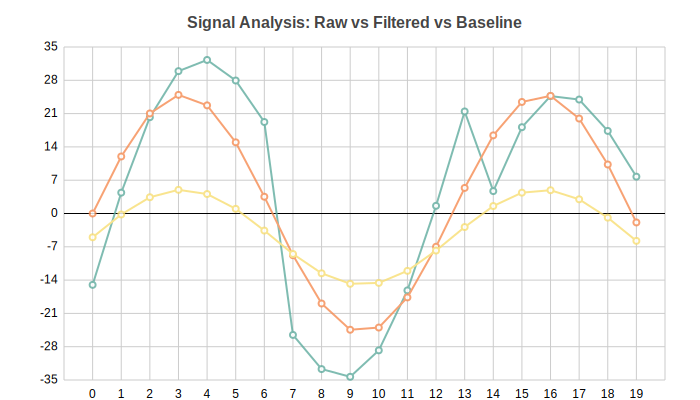

charted
=======

**Zero-dependency SVG chart generator** — simple interface, beautiful output, no external libraries required.

.. code-block:: bash

   pip install charted

**Key Features:**

- **Zero runtime dependencies** — pure Python stdlib, no numpy/pandas needed
- **5 chart types** — Bar, Column, Line, Scatter, Pie (with doughnut mode)
- **Multi-series support** — stacked, side-by-side, grouped layouts
- **Negative values handled** — proper zero baseline calculations
- **Theme system** — 3 built-in themes + custom dict overrides
- **Data loading** — CSV/JSON parsers built-in
- **Markdown export** — generate embed-ready markdown snippets
- **CLI included** — create charts without writing Python code
- **Jupyter ready** — charts render inline automatically
- **Base Chart class** — unified API for dynamic chart type selection

Quick Start
-----------

.. code-block:: python

   from charted import BarChart

   # Create and save a chart in 3 lines
   chart = BarChart(data=[120, 180, 210], labels=["Q1", "Q2", "Q3"])
   chart.save("sales.svg")

That's it — no dependencies, no configuration needed.

.. toctree::
   :maxdepth: 2
   :caption: Getting Started

   getting_started

.. toctree::
   :maxdepth: 2
   :caption: Charts

   charts/line
   charts/bar
   charts/column
   charts/scatter
   charts/pie

.. toctree::
   :maxdepth: 1
   :caption: API Reference

   api/charts
   api/themes

.. toctree::
   :maxdepth: 1
   :caption: Configuration

   config

Indices and tables
==================

* :ref:`genindex`
* :ref:`modindex`
* :ref:`search`
